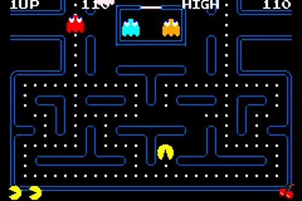

## Move around the pi terminal

In this step, we will learn how to get Pacman to navigate the pi terminal, just like when Pacman moves around the maze.




### Listing directory content

+ After the shell prompt, type `ls` and press enter. Make sure you type the letter l as in "lime" and not the number 1.
```bash
ls
```
You should get a similar result to this:


`ls` looks at the folder you are in then "lists" the files and **directories** inside it. Here, we cannot see any files, because there are none at this level, but we can see lots of directories. When using the terminal, folders are called directories.

The directory, or folder we are in, therefore contains these directories:
***Desktop, Downloads, Pictures, python_games, Scratch Projects, Videos, Documents, Music, Public, Scratch, and Templates***


### Print Working Directory

+ Now, type `pwd` and press enter.
```bash
pwd
```
This is what you should get (results in the red box):


`pwd` stands for "print working directory". It tells you what directory you are currently in so you will not get lost. It shows where you are in the Pi's **filesystem**, and here we can see we are in the **pi/** directory.

The filesystem is how files and directories on your computer are organised. A filesystem usually organises a computer's files and directories into a tree structure:

IMAGE OF FILE SYSTEM CHANGE FILEMANAGER IMAGE TOO 


### Changing Directory

+ To move into a different directory, type `cd Documents/` and press enter.
```bash
cd Documents/
```


`cd` stands for stands for "change directory". Just as you can click on folders and go into them, `cd` lets you into the directory you want to go into. To get into a directory, you type the command `cd` followed by the name of the directory. So here, `cd Documents/` navigated directly to the **Documents/** directory,

The terminal also tells us that we are in **Documents/**:


### Moving Directory

+ Move up (or back) one directory by typing `cd ..` and pressing enter.
```bash
cd ..
```
`cd ..` navigated up from **home/pi/documents** back to **home/pi/**.

I also quickly checked my directory by using the `pwd` command:


Now, you're ready to catch your first ghost!
